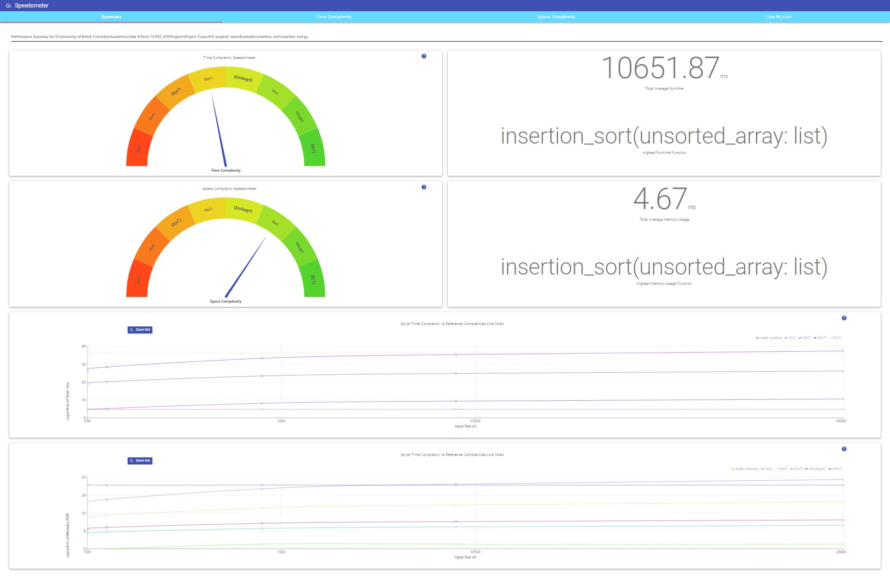

# Speedometer

[Watch the video here](https://drive.google.com/file/d/1Sw31UE2h0gWIgypsrU14E9wYE4hArfLq/view)



## Requirements

- Python 3.x
- Docker (with sudo privileges if on linux)
    - You also need to download the Scalene docker image from [here](https://drive.google.com/file/d/11ToQiG0ONLSz_8-D3dS5OLkXvDHIZyJC/view?usp=sharing) and place it under `<project root>/resources`
- Other python dependencies:
    - Run `pip install -r requirements.txt` in the root folder of the project
- Yarn
- At least 10 GB of free space on your computer (docker images are large!)

## Setup

> Note: Due to the nature of this tool, it requires downloading large dependencies. This may take some time - use a wired/fast internet connection if you can!

1. Ensure you have Python 3.x installed as well as the latest version of pip. Test your installation using:

    ```shell
    $ python --version
    Python 3.7.0
    
    $pip --version
    pip 19.0.3
    ```
    
2. Ensure you have Docker installed. You can follow the instructions [here](https://docs.docker.com/get-docker/) to install it. Test your installation using:

    ```shell
    $ docker run hello-world
    ```
    This will run the hello-world docker container and print a message if everything works.
    
3. (Optional but recommended) To speed up the analysis process, please pull the latest `python` Docker image using:

    ```shell
    $ docker pull python
    ```
    
    Then test that it has been successfully downloaded (it may take a few minutes) using:
    
    ```shell
    $ docker images -a
    
    REPOSITORY          TAG                 IMAGE ID            CREATED             SIZE
    python              latest              a3fe352c5377        12 days ago         886MB
    ```
    
    This is optional since Speedometer will pull this image automatically if not present, but performing this beforehand speeds up the analysis process the first time you run it.

4. Ensure you have the latest version of Yarn installed. You can follow the instructions [here](https://classic.yarnpkg.com/en/docs/getting-started) to install it. Test your installation using:

    ```shell
    $ yarn --version
    1.19.0 
    ```
    
5. You may have to restart your computer after steps 1-4

6. Clone the repo into your local computer. We will refer to the cloned project folder as `<project root>`
7. Download the Python dependencies using the following command **in `<project root>`**:

    ```shell
    $ pip install -r requirements.txt
    ```

7. Download the Scalene docker image tar ([available here](https://drive.google.com/file/d/11ToQiG0ONLSz_8-D3dS5OLkXvDHIZyJC/view?usp=sharing)) and place it under `<project root>/resources`. This is how it should look:

    
    
    Text file labelled (1) is there to identify where to put the tar file.
    (2) shows how the downloaded tar file should be placed
    
8. (Optional but recommended) To speed up the analysis process, navigate to `<project root>/src/client` where you will find a `package.json` file. Install the yarn dependencies for the client using:

    ```shell
    $ yarn install
    ```
    
    This is optional since Speedometer will run this the first time you analyze a script, but you can speed up the analysis process by installing the dependencies before-hand

## Usage

> Note: Speedometer runs multiple trials of the test program for each input size, and therefore analysis can take up to 5 mins (longer if you are running it for the first time and haven't manually downloaded the optional dependencies above). Please be patient! Make sure to use the `-v` verbose flag to get detailed logging.

Test your setup using one of our sample scripts under `<project root>/samples`. Each sub-directory contains a python script as well as a configuration file (learn more about config files [here](#explanation-of-config-file)). We've also included a `results_visualization` sub-folder that contains the visualization that is generated for each script using Speedometer, in case you aren't able to run the analysis yourself.

For this example, we will run `merge_sort` (which is just regular merge sort):

From the root directory of the project run (assuming your Python 3.x installation is under `python3`):

```shell
python3 src/MainCLI.py -v --program "samples/merge_sort/merge_sort.py" --config "samples/merge_sort/config.json" -v
```

where `--program` gives the path to the python file, `--config` gives the path to the config file and `-v` is a (optional) flag for verbose output

Let the program run for a few minutes. If this is the first time you're running Speedometer, this can take up to 10 mins.

Once the analysis is complete, a browser window should automatically open to show a visualization of the results. If it does not open automatically, you can open it manually through `<project root>/dist/build/index.html`. 

You can view the visualization generated for `merge_sort.py` [here](samples/merge_sort/results_visualization) (open index.html in browser).

All samples with visualizations:

- Merge Sort:

```shell
python3 src/MainCLI.py -v --program "samples/merge_sort/merge_sort.py" --config "samples/merge_sort/config.json" -v
```

View the generated [results here](samples/merge_sort/results_visualization)

- Insertion Sort

```shell
python3 src/MainCLI.py -v --program "samples/insertion_sort/insertion_sort.py" --config "samples/insertion_sort/config.json" -v
```

View the generated [results here](samples/insertion_sort/results_visualization)


- Inefficient Fibonacci

```shell
python3 src/MainCLI.py -v --program "samples/fibonacci/fibonacci.py" --config "samples/fibonacci/config.json" -v
```

View the generated [results here](samples/fibonacci/results_visualization)


- Binary Search

```shell
python3 src/MainCLI.py -v --program "samples/binary_search/binary_search.py" --config "samples/binary_search/config.json" -v
```

View the generated [results here](samples/binary_search/results_visualization)


- Constant time/space loop

```shell
python3 src/MainCLI.py -v --program "samples/constant_loop/constant_loop.py" --config "samples/constant_loop/config.json" -v
```

View the generated [results here](samples/constant_loop/results_visualization)


## Explanation of config file

The config file tells Speedometer the arguments to give the test python script that would make it run the program for a specific input size.

For example, the config file below:

```json
{
    "arguments": {
      "500": [500, "-f"],
      "1000": [1000, "-f"],
      "5000": [5000, "-f"],
      "10000": [10000, "-f"],
      "20000": [20000, "-f"]
    }
}
```

Tells Speedometer that to run the test script with input size 500, give it arguments `[500, "-f"]`. So the test script would be run as follows:

```shell
python test.py 500 -f
```

Likewise, the arguments to run the script with input size 1000 are `[1000, "-f"]`, and so on...

### Writing good config files:

To get good analysis results, ensure that the input sizes given result in the script running for at least 2 seconds. Further, the more 'range' of inputs you provide, the more accurate the results will be (since it will be closer to the average case). However, the larger the inputs, the longer the analysis will take - and the growth in time may be exponential.

## Limitations

* Mac OS or Linux only
* Does not support multi-file projects yet
* Only supports standard python libraries - cannot import external libraries in test scripts
* The test script must run for at least 2 seconds on the smallest input.
* Running multiple analysis back-to-back can affect results due to thermal throttling of the CPU

## Development

### Requirements

* Pytest for Python 3.x

### Running unit tests

Use the following command from `<project root>` to run the unit test suite:

```shell
$ pytest -vvs
```

